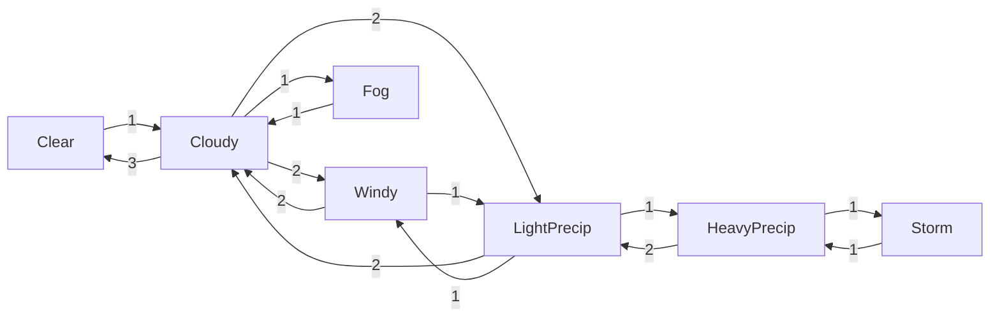

# Architecture

Mountain-survival expedition game for Roblox (Luau, synced with Rojo). This document describes
what the code in `src/` **actually does**. Anything not yet in code is marked **(planned)**.
Status by milestone is tracked in [ROADMAP.md](ROADMAP.md).

> Status: code-complete vertical slice, **not yet play-tested in Roblox Studio**. The pure logic
> layer is unit tested (`tests/`); everything that touches the engine has only been compiled and
> linted, never run.

Contents

1. [Architecture overview](#1-architecture-overview)
2. [Workstreams mapped to files](#2-workstreams-mapped-to-files)
3. [Dependency graph](#3-dependency-graph)
4. [Folder structure and Roblox instance tree](#4-folder-structure-and-roblox-instance-tree)
5. [Data models](#5-data-models)
6. [Remote architecture](#6-remote-architecture)
7. [Service architecture](#7-service-architecture)
8. [Item architecture](#8-item-architecture)
9. [Equipment architecture](#9-equipment-architecture)
10. [Survival architecture](#10-survival-architecture)
11. [Building architecture](#11-building-architecture)
12. [Weather architecture](#12-weather-architecture)
13. [Disaster architecture](#13-disaster-architecture)
14. [Security model](#14-security-model)
15. [Performance notes](#15-performance-notes)
16. [CollectionService tag contract (hand-built maps)](#16-collectionservice-tag-contract-hand-built-maps)

---

## 1. Architecture overview

### Server-authoritative model

The server owns every gameplay fact: stats, inventory, injuries, weather, structures, disasters,
checkpoints, XP. Clients only:

- **render** state the server publishes (Player attributes, `ReplicatedStorage.WorldState`
  attributes, and a handful of server-to-client events), and
- **send intents** ("use stack 7", "build campfire here", "start climbing") through a fixed set of
  validated remotes, or trigger server-created ProximityPrompts.

The one deliberate exception is **character motion**. Roblox gives each client network ownership
of its own character, so walking and the climbing motion are simulated on the client. The server
constrains it instead of driving it: it sets `WalkSpeed` / `JumpHeight` every survival tick from
the survival modifiers, compares real displacement against them (snapping back sustained
violations), decides whether a climb may start or must stop, and checks vertical climb speed.
See [Security model](#14-security-model).

### Registry service locator

`src/server/Registry.luau` is a 20-line service locator. Services never `require` each other;
they call `Registry.get("Name")` **at call time**. This avoids require cycles (Survival needs
Rescue to down a player, Rescue needs Survival to stop resting) and keeps each service file
independent.

Bootstrap (`src/server/init.server.luau`):

1. `WorldBuilder.build()` generates the greybox map unless `Workspace.Mountain` already exists.
2. Every service in `ORDER` is `require`d and registered. Registering everything before any
   `Init` means lookups inside `Init`, `Start` and handlers always resolve.
3. `Init()` on every service in order: create remotes/folders, register remote handlers.
   `RemoteGuard` is first because the others call `RemoteGuard.on` in their `Init`.
4. `Start()` on every service in order: connect events, start loops.

Order: RemoteGuard, DataService, ProgressionService, InventoryService, SurvivalService,
ClimbingService, WeatherService, BuildingService, ResourceService, CampService, RescueService,
DisasterService, ExpeditionService, EquipmentService, PlayerService.

Services talk through two mechanisms only: direct calls via `Registry.get`, and three `Signal`s
(`DataService.ProfileLoaded`, `InventoryService.Changed`, `WeatherService.StateChanged`).

### PlayerStore

`src/server/PlayerStore.luau` holds the **single server-side record per player**
(`PlayerStore.Record`, see [Data models](#5-data-models)). Every service reads and mutates the
same record; there is no per-service copy of player state. `PlayerStore.getActive(player)` is the
standard guard: it returns `record, character, humanoid, root` only when the profile has loaded
(`record.ready`) and the character is alive, so handlers can early-out with one line.

### Pure Logic layer, tested outside Roblox

`src/shared/Logic/*` (SurvivalModel, WarmthModel, InjuryModel, InventoryModel, WeatherModel)
contains all the gameplay math and has **no Roblox service calls**. Randomness is injected
(`WeatherModel.pickNext(id, rng)`) or kept in services. These modules, plus everything in
`src/shared/Config`, run in a plain Luau VM under `tests/harness.luau`, which fakes the `script`
tree and stubs `Vector3`/`Color3`. Services are thin: sample the world, call the model, apply
the result, publish.

### Tag-based world contract

Gameplay never looks objects up by path. Everything interactive is found through
CollectionService tags (`Camp`, `SupplyCrate`, `Outfitter`, `WoodSource`, `WaterSource`,
`WaterVolume`, `RockfallZone`, `SectionEnd`, `Climbable`) plus attributes and named children. The
generated greybox world (`WorldBuilder` from `WorldLayout`) uses exactly the same tags, so a
level designer can replace it with a hand-built Studio map named `Workspace.Mountain` and every
system keeps working. Full contract in [section 16](#16-collectionservice-tag-contract-hand-built-maps).

---

## 2. Workstreams mapped to files

| Workstream | Owns | Notes / status |
|---|---|---|
| Lead Architect | `default.project.json`, `src/server/init.server.luau`, `Registry.luau`, `PlayerStore.luau`, `src/shared/Net/Remotes.luau`, `docs/` | Bootstrap order, service contracts, remote list |
| Gameplay | `Config/GameConfig.luau`, `Services/ExpeditionService.luau`, `Services/CampService.luau`, `Services/PlayerService.luau` | Director (snow + storm pacing), checkpoints, respawn, section end |
| Survival | `Config/SurvivalConfig.luau`, `Config/InjuryDefs.luau`, `Logic/SurvivalModel.luau`, `Logic/WarmthModel.luau`, `Logic/InjuryModel.luau`, `Services/SurvivalService.luau` | Unit tested |
| Climbing | `Config/ClimbConfig.luau`, `Services/ClimbingService.luau`, `client/Controllers/ClimbingController.luau` | Needs Studio feel testing |
| Inventory / Equipment | `Config/ItemDefs.luau`, `Config/LoadoutConfig.luau`, `Logic/InventoryModel.luau`, `Services/InventoryService.luau`, `Services/EquipmentService.luau`, `client/Controllers/InventoryController.luau`, `client/Controllers/PanelController.luau` | Inventory model stress-tested (10k ops) |
| Building | `Config/RecipeDefs.luau`, `Services/BuildingService.luau`, `client/Controllers/BuildBookController.luau` | 4 of 10 recipes implemented |
| Weather | `Config/WeatherDefs.luau`, `Logic/WeatherModel.luau`, `Services/WeatherService.luau`, `client/Controllers/WeatherController.luau` | Client rendering is cosmetic only |
| Disaster | `Services/DisasterService.luau` | Rockfall only; avalanche **(planned)** |
| World | `Config/WorldLayout.luau`, `Config/ZoneDefs.luau`, `World/WorldBuilder.luau`, tag contract | Greybox terrain + props |
| 3D Art | `World/AssetFactory.luau` (greybox primitives with named attachment anchors), `docs/ASSET_SPECS.md` | All art is greybox; particle textures are engine defaults |
| UI/UX | `client/UI/UI.luau`, `client/ClientState.luau`, `client/init.client.luau`, `HUDController`, `NotificationController`, `InventoryController`, `BuildBookController`, `PanelController`, `SummaryController`, `ConditionController` | All UI built in code |
| Multiplayer | `Services/RescueService.luau`, Give/Treat in `InventoryService`, Ping in `ExpeditionService`, rejoin stash in `PlayerService`, `client/Controllers/PingController.luau`, carry/drop in `MovementController` | Needs multi-client Studio testing |
| Audio / VFX | `client/AudioConfig.luau`, `client/Controllers/AudioController.luau`, `PlaySound` remote, particles in `DisasterService`/`WeatherController`/`ConditionController`, fire/smoke in `AssetFactory` | Every sound id in AudioConfig is `""`, so the game is **silent** until audio art supplies ids |
| Data | `Services/DataService.luau`, `Services/ProgressionService.luau`, `Config/ProgressionConfig.luau` | Needs live DataStore testing |
| Security | `Security/RemoteGuard.luau`, `Util/Validate.luau`, `Services/PromptUtil.luau`, range/ownership checks in each service | See section 14 |
| Performance | Single survival loop, publish thresholds, pooling (see section 15) | No profiling done yet |
| QA | `tests/check.sh`, `tests/run.sh`, `tests/compile_check.luau`, `tests/harness.luau`, `tests/spec.luau`, `docs/TESTING.md` | Logic suite passes (45 tests at time of writing); manual Studio test plan in TESTING.md |

### Client controllers

`src/client/init.client.luau` requires the controllers in a fixed order, runs every `Init()`
(build UI, local instances; no remotes), then every `Start()` (connect remotes and input) each in
its own thread. Every step is `pcall`ed, so one broken controller only loses its own feature.
Controllers present but missing from `ORDER` still start, last, with a warning.

| Controller | Does | Remotes / state it uses |
|---|---|---|
| NotificationController | toasts + big top-centre warnings | `Notify` |
| PanelController | Outfitter and supply-crate panels | `OpenPanel`, `Outfit`, `Supply` |
| InventoryController | pack screen (Tab / I): worn slots, contents, item actions, body status | `InventorySync`, `GetSnapshot`, `Inventory` |
| BuildBookController | Build Book (B), placement ghost, R rotate | `Build` |
| HUDController | survival bars, info lines, injuries, weight, teammates, build progress, downed overlay with hold-to-confirm "Give up" | Player attributes, `GiveUp` |
| ClimbingController | C to grab/let go, W/A/S/D on the wall, Space jumps off; AlignPosition/AlignOrientation | `ClimbStart`, `ClimbStop`, `ClimbForceStop` |
| MovementController | Shift sprint, jump reporting, stop resting on move, X sets down a carried teammate, hides the downed player's own prompts (`OwnerUserId`), sprint FOV, disables CoreGui backpack/player list/reset | `SetSprint`, `ReportJump`, `StopRest`, `DropCarried` |
| WeatherController | Atmosphere/lighting from fog and cloud, a client-only rain/snow emitter above the camera (rain or snow from the local `TempC` attribute), hidden when `InShelter`, lightning flashes in heavy rain | `WorldState` attributes |
| AudioController | wind/rain/blizzard/fire ambience, breathing/heartbeat/shivering, one-shots | `PlaySound`, `WorldState`, Player attributes |
| ConditionController | breath vapour on every character below 4 C, cold/thin-air/downed screen grading, shiver, capped camera shake | `CameraShake`, Player attributes |
| PingController | G marks a spot; markers with name and live distance for 8 s, max 10 | `Ping`, `PingBroadcast` |
| SummaryController | end-of-section stats panel | `ExpeditionSummary` |

---

## 3. Dependency graph

Arrows mean "calls through `Registry.get`" (dotted arrows are Signal subscriptions).
Every service also calls `RemoteGuard` for notifications; those edges are omitted for clarity.
All services require `PlayerStore` directly; `BuildingService`, `ResourceService`,
`EquipmentService` and `WorldBuilder` require `AssetFactory` directly.

```mermaid
flowchart LR
  subgraph Core
    RG[RemoteGuard]
    DS[DataService]
    PS[ProgressionService]
  end
  PLS[PlayerService] --> CS[CampService]
  PLS --> SS[SurvivalService]
  PLS --> EQ[EquipmentService]
  PLS --> INV[InventoryService]
  PLS --> RS[RescueService]
  PLS --> DS
  DS -. ProfileLoaded .-> PLS
  DS -. ProfileLoaded .-> PS
  PS --> DS

  SS --> INV
  SS --> WS[WeatherService]
  SS --> BS[BuildingService]
  SS --> CS
  SS --> CL[ClimbingService]
  SS --> RS

  CL --> SS
  CL --> INV

  INV --> SS
  INV --> RES[ResourceService]
  INV --> PS
  INV --> DS
  INV -. Changed .-> EQ

  BS --> SS
  BS --> INV
  BS --> WS
  BS --> PS

  RES --> INV

  CS --> RS
  CS --> DS
  CS --> PS
  CS --> EX[ExpeditionService]
  CS --> BS

  RS --> SS
  RS --> CL
  RS --> INV
  RS --> DS
  RS --> PS
  RS --> RES
  RS --> BS

  DIS[DisasterService] --> SS
  DIS --> WS

  EX --> WS
  EX --> DS
  EX --> PS

  EQ --> INV
  EQ --> WS
```



Key call sites:

| Caller | Callee: functions used |
|---|---|
| PlayerService | CampService.spawnFor; SurvivalService.refreshCharacterFilter, refreshGear; EquipmentService.refresh; InventoryService.setupLoadout, sync; DataService.markDirty; RescueService.releaseAll |
| SurvivalService | WeatherService.sampleAt; BuildingService.environmentAt; InventoryService.weightRatio, wornItems; CampService.isInCamp, recoverToCheckpoint; ClimbingService.tick, forceStop; RescueService.down |
| ClimbingService | SurvivalService.groundRaycastParams, setResting; InventoryService.heldItemId |
| InventoryService | SurvivalService.refreshGear, changeHealth; ResourceService.spawnContainer; ProgressionService.rankIndex; DataService.get, markDirty |
| BuildingService | SurvivalService.setResting; InventoryService.count, removeAll, useToolCharge, cookAll, boilContainers, fillContainers; WeatherService.sampleAt; ProgressionService.hasBlueprint, achieve |
| ResourceService | InventoryService.add, fillContainers, sync |
| CampService | BuildingService.registerPermanentFire, registerShelter; ProgressionService.award, rankIndex; ExpeditionService.onCheckpoint, sectionComplete; RescueService.releaseAll; DataService.get, markDirty |
| RescueService | SurvivalService.setResting; ClimbingService.forceStop; InventoryService.count, removeAll, takeAll, add, sync; ResourceService.spawnContainer; BuildingService.environmentAt; ProgressionService.award; DataService.get, markDirty |
| DisasterService | SurvivalService.addInjury, changeHealth; WeatherService.params |
| ExpeditionService | WeatherService.force, currentId; ProgressionService.award; DataService.get, markDirty |
| EquipmentService | InventoryService.heldItemId, Changed; WeatherService.sampleAt |

---

## 4. Folder structure and Roblox instance tree

```
Game/
├── default.project.json         Rojo project (below)
├── rokit.toml                   rojo 7.4.4, stylua 2.0.2, selene 0.27.1
├── selene.toml, roblox_lite.yml offline Roblox std for selene
├── stylua.toml
├── docs/                        ARCHITECTURE.md, ROADMAP.md, ASSET_SPECS.md
├── src/
│   ├── shared/                  -> ReplicatedStorage.Shared (Folder)
│   │   ├── Config/              ClimbConfig, GameConfig, InjuryDefs, ItemDefs, LoadoutConfig,
│   │   │                        ProgressionConfig, RecipeDefs, SurvivalConfig, WeatherDefs,
│   │   │                        WorldLayout, ZoneDefs
│   │   ├── Logic/               InjuryModel, InventoryModel, SurvivalModel, WarmthModel, WeatherModel
│   │   ├── Net/Remotes.luau     every remote: kind, schema, rate limit
│   │   └── Util/                Signal, Validate
│   ├── server/                  -> ServerScriptService.Server (Script, from init.server.luau)
│   │   ├── init.server.luau     bootstrap
│   │   ├── Registry.luau        service locator
│   │   ├── PlayerStore.luau     per-player record
│   │   ├── Security/RemoteGuard.luau
│   │   ├── Services/            14 services + PromptUtil helper
│   │   └── World/               WorldBuilder, AssetFactory
│   └── client/                  -> StarterPlayer.StarterPlayerScripts.Client
│       ├── init.client.luau     bootstrap (Init all, then Start all)
│       ├── ClientState.luau     client mirror (inventory snapshot, open panel)
│       ├── AudioConfig.luau     sound ids (all empty until audio art exists)
│       ├── Controllers/         Notification, Panel, Inventory, BuildBook, HUD, Climbing,
│       │                        Movement, Audio, Weather, Condition, Ping, Summary
│       └── UI/UI.luau           theme + declarative helpers (all UI built in code)
└── tests/                       check.sh, run.sh, compile_check.luau, harness.luau, spec.luau
```

Rojo mapping (`default.project.json`):

| Filesystem | Instance | Class |
|---|---|---|
| `src/shared` | `ReplicatedStorage.Shared` | Folder of ModuleScripts |
| `src/server` | `ServerScriptService.Server` | Script (from `init.server.luau`); siblings become child ModuleScripts, so `script.Services.X` resolves |
| `src/client` | `StarterPlayer.StarterPlayerScripts.Client` | LocalScript (from `init.client.luau`) with child ModuleScripts |
| (properties) | `Workspace` | `StreamingEnabled = true`, `Gravity = 196.2` |
| (properties) | `Lighting` | `ClockTime 9.5`, `Brightness 2.5`, `GlobalShadows true`, env diffuse/specular 1 |

Instances created at runtime:

| Instance | Created by | Contents |
|---|---|---|
| `ReplicatedStorage.Remotes` | RemoteGuard.Init | one RemoteEvent/RemoteFunction per entry in Remotes.luau |
| `ReplicatedStorage.WorldState` | WeatherService.Init | weather attributes (section 5) |
| `Workspace.Mountain` | WorldBuilder (only if absent) | terrain, Trees, Rocks, Resources, camp Models, StreamVolume, WorldFloor, RockfallZone_EastGully, SectionEnd, Cairn, ColFlag |
| `Workspace.Structures` | BuildingService.Init | player-built fires, tarps, wind walls, markers |
| `Workspace.GroundItems` | ResourceService.Init | dropped items, evacuated players' packs |
| `Workspace.DisasterEffects` | DisasterService.Init | dust emitters, pebbles, pooled boulders |
| `<Character>.Gear` | EquipmentService | clothing shells, backpack, harness, stowed and held gear |
| `Lighting.Atmosphere` | WorldBuilder (if missing) | haze |

---

## 5. Data models

### PlayerStore.Record (server only, never replicated as a whole)

```lua
{
  player, ready: boolean,            -- ready once the profile loaded and loadout applied
  profile: Profile,                  -- live DataService profile (same table)
  survival: SurvivalModel.State,
  inventory: InventoryModel.Inventory,
  worn: { [ClothingSlot]: itemId },  -- Head, Face, BaseLayer, Jacket, Gloves, Pants, Boots
  backpackId: string,
  heldUid: string?,                  -- stack held in hand (ice axe)
  -- action state
  sprintRequested, exertion,         -- idle | walk | sprint | climb | carry | rest
  climbing: { normal, lastY, startedAt }?,
  resting, restingAtCamp, downed, bleedOut,
  carrying: Player?, carriedBy: Player?,
  peakY: number?, airborne,          -- fall tracking
  -- expedition (not persisted)
  checkpoint: number,                -- index of last signed camp (1 = Base Camp)
  outfitterTaken: { [itemId]: true },
  supplyTaken: { [crateId]: { [itemId]: count } },
  stats: ExpeditionStats,            -- startedAt, maxElevationM, distanceStuds, highestCheckpoint,
                                     -- weatherSurvived{}, disastersSurvived, teammatesRescued,
                                     -- itemsConsumed, injuries, resourcesCollected, sectionComplete
  lastPosition, lostSince,
  -- movement sanity
  lastGoodPosition: Vector3?, speedViolation: number, groundY: number?,
}
```

`PlayerStore.teleported(record)` must be called after any server-side teleport so movement and
fall checks start fresh. On leave, the record is stashed for `REJOIN_GRACE_SECONDS = 600` keyed by UserId; rejoining the
**same server** inside that window restores it (pack, injuries, checkpoint, allowances). The
stash is the only copy, so nothing is duplicated.

### SurvivalModel.State

```lua
{
  stamina, hunger, thirst, fatigue,       -- 0..100 (stamina capped by modifiers.maxStamina)
  oxygen,                                 -- 35..100, derived from elevation each step
  altitudeSickness,                       -- 0..100
  wetness,                                -- 0..1
  warmth = { Head, Torso, Hands, Legs, Feet },        -- 0..100 each
  frostExposure = { Hands, Feet, Head },  -- seconds-ish accumulator
  staminaCooldown, exhaustedLock, criticalColdTime,
  injuries = { [injuryId]: { id, age, splinted, campRest } },
  buffs = { [buffId]: secondsRemaining }, -- Electrolytes, HandWarmer
}
```

### Inventory / Stack

```lua
Inventory = { stacks: { Stack }, nextUid: number }
Stack     = { uid: string, itemId: string, qty: number, data: { [string]: any }? }
-- data examples: water_bottle { ml, treated, hot, hotUntil }, lighter { uses }
```

Rules (InventoryModel): stacks merge up to `maxStack` only when both have no `data`;
containers never merge; container weight = item weight + `ml * 0.001` kg; `removeAll(cost)` is
atomic. Slot limit comes from the backpack; the hard weight cap (130% of pack limit) is enforced
by `InventoryService.add`.

`InventorySync` snapshot sent to the owner:
`{ stacks, worn, backpackId, heldUid, weight, weightLimit, slots }`.

### Persisted Profile (DataService)

DataStore `MountainProfiles_v1`, key `u_<UserId>`, stored value `{ profile = Profile, lock = { jobId, time } }`.

```lua
Profile = {
  schema = 1,
  xp: number,
  loadout: { [slot | "Backpack"]: itemId },   -- worn clothing + pack chosen at the outfitter
  blueprints: { [recipeId]: true },           -- defaults = recipes with unlockedByDefault
  achievements: { [id]: unixTime },           -- e.g. first_shelter
  totals = { expeditions, sectionsCompleted, summits, rescues, checkpoints, maxElevationM },
  settings = { cameraShake: boolean },
}
```

Deliberately **not persisted**: pack contents, injuries, position, checkpoint. An expedition is a
session with friends; XP, unlocks and preferred loadout carry over.

### Attributes published to clients

Player attributes (server-written; numeric ones are only rewritten when they move by at least
the step shown, then rounded to that step):

| Attribute | Source | Step / type |
|---|---|---|
| Stamina, MaxStamina, Hunger, Thirst, Fatigue, Oxygen, Warmth | SurvivalService | 0.5 |
| AltitudeSickness | SurvivalService | 1 |
| WarmHead, WarmTorso, WarmHands, WarmLegs, WarmFeet | SurvivalService | 1 |
| Wetness | SurvivalService | 0.02 (0..1) |
| ElevationM | SurvivalService | 5 |
| TempC, WindMs | SurvivalService (air temp and effective wind at the player) | 0.5 |
| ClimbSpeed | SurvivalService | 0.1 |
| ColdLevel (`None/Mild/Moderate/Severe/Critical`), Exertion, Injuries (`"BrokenLeg*,Bleeding"`, `*` = splinted), Zone, Weather (display name) | SurvivalService | string |
| InShelter, NearFire, CanSprint, CanClimb, Resting | SurvivalService | bool |
| Weight (0.1 kg), WeightLimit, HeldItem | InventoryService.sync | number / string |
| Climbing | ClimbingService | bool |
| Downed, BleedOut, Carrying, CarriedBy | RescueService | bool / int / display name |
| Checkpoint, CheckpointName | PlayerService, CampService | int / string |
| XP, RankIndex, Rank | ProgressionService | |
| BuildingUntil | BuildingService | server time (`GetServerTimeNow`) when the build finishes |

`ReplicatedStorage.WorldState` attributes, written every 0.5 s: `WeatherFrom`, `WeatherTo`,
`WeatherBlend` (0..1), `WindMs`, `WindDirection` (unit Vector3), `Precipitation`, `Fog`,
`Cloud`, `TempOffsetC`.

Instance attributes: `Remaining` on WoodSources, `Builder` (UserId) on built structures,
`OwnerUserId` on a downed player's Revive/Carry prompts (MovementController hides them on that
player's own client).

---

## 6. Remote architecture

All remotes are declared in `src/shared/Net/Remotes.luau` and created by `RemoteGuard.Init`
in `ReplicatedStorage.Remotes`. Each client-to-server remote has exactly one handler
(`RemoteGuard.on`) and goes through: token-bucket rate limit -> schema validation (types,
ranges, NaN/inf, extra args rejected) -> `pcall`ed handler. A rejected RemoteFunction returns
`false, "Request rejected."`; a handler error returns `false, "Something went wrong."`.

### Client -> Server

| Remote | Kind | Args (schema) | Rate / burst | Handler -> effect |
|---|---|---|---|---|
| SetSprint | Event | `boolean` | 8/s, 12 | SurvivalService: `record.sprintRequested` (server still decides exertion from real velocity, stamina, injuries) |
| ReportJump | Event | none | 3/s, 4 | SurvivalService: spend `JumpCost` stamina, reset regen delay |
| ClimbStart | Event | `Vector3` normal hint, magnitude <= 1.5 | 4/s, 6 | ClimbingService: validate and start, else `ClimbForceStop(reason)` |
| ClimbStop | Event | optional `boolean` (mantle) | 6/s, 8 | ClimbingService: end climb |
| Ping | Event | `Vector3` within 20000 of origin | 0.5/s, 3 | ExpeditionService: if within `PING_RANGE` (600) of the player, `PingBroadcast` to all |
| StopRest | Event | none | 4/s, 4 | SurvivalService.setResting(false) |
| DropCarried | Event | none | 2/s, 3 | RescueService.release (set down a carried teammate) |
| GiveUp | Event | none | 0.5/s, 2 | RescueService.evacuate, only while downed |
| Inventory | Function | `oneOf(Use, Drop, Equip, Unequip, Give, Treat, Hold, Stow)`, `string(<=12)` stack uid (slot name for Unequip), optional `integer(1..2^53)` (target UserId for Give/Treat, qty for Drop) | 6/s, 10 | InventoryService -> `(ok, message)` then `InventorySync` |
| Outfit | Function | `string(<=32)` itemId | 4/s, 8 | InventoryService: must be near an `Outfitter`; wear clothing / switch pack / take one-off tool |
| Supply | Function | `string(<=32)` crateId, `string(<=32)` itemId | 4/s, 8 | InventoryService: must be near that `SupplyCrate`; per-player allowance |
| Build | Function | `string(<=32)` recipeId, `CFrame` (finite, within 20000) | 1/s, 3 | BuildingService: full validation, yields for the build timer, returns `(ok, message)` |
| GetSnapshot | Function | none | 2/s, 4 | InventoryService.snapshot or `nil` before ready |

### Server -> Client (RemoteEvents, no schema: the server is trusted)

| Remote | Args | Fired by | Client consumer |
|---|---|---|---|
| InventorySync | snapshot | InventoryService.sync | InventoryController |
| Notify | text, severity (`info/good/warn/danger`), key? | RemoteGuard.notify (per-key cooldowns) | NotificationController |
| OpenPanel | panelName (`Supply`/`Outfitter`), data | CampService prompts | PanelController |
| ClimbForceStop | reason? (`""`/nil = silent) | ClimbingService | ClimbingController |
| PingBroadcast | position, fromName, fromUserId | ExpeditionService | PingController |
| CameraShake | intensity, duration | SurvivalService (falls), DisasterService | ConditionController |
| ExpeditionSummary | summary table (see ExpeditionService.summaryFor) | ExpeditionService.sectionComplete | SummaryController |
| PlaySound | soundKey, position? | DisasterService (`"Rumble"`) | AudioController (key must exist in AudioConfig) |

Note: the comment in `Remotes.luau` documents `PingBroadcast` as `(position, fromName)`; the
server sends `fromUserId` as a third argument and PingController reads it.

### Why most world interactions are ProximityPrompts, not remotes

A ProximityPrompt created **by the server** fires `Triggered` **on the server** with the real
`Player`. That gives a free, engine-authenticated interaction channel with no custom remote, no
schema and nothing to forge except "I pressed the key". `PromptUtil.create` adds the rest:

- each prompt lives on its own Attachment so several prompts on one object don't overlap;
- distinct keys per object (E / F / Q) so prompts never fight over input;
- **range re-check** on trigger (`distance <= MaxActivationDistance + 4`), because exploit tools
  can fire prompts from anywhere;
- the handler runs in `pcall`.

| Object | Prompt (key, hold, distance) | Effect |
|---|---|---|
| Camp logbook | Sign the logbook (E, 1 s, 10) | checkpoint, XP, director hook |
| Supply crate | Open supply crate (E, 0, 10) | `OpenPanel("Supply")` |
| Outfitter | Change gear (E, 0, 12) | `OpenPanel("Outfitter")` |
| Fire | Rest by the fire (E, 0, 12) · Cook food & boil water (Q, 2 s, 9) · Add wood (F, 0, 9; built fires only) | rest; cook/boil/melt snow; +90 s fuel |
| Tarp shelter | Rest under the tarp (E, 0, 8) · Reinforce (1 rope) (F, 1.5 s, 8) | rest; +60 durability |
| WoodSource | Gather wood (E, 1.5 s, 9) | +1 wood |
| WaterSource | Fill bottles (E, 1 s, 10) · Drink (F, 0.5 s, 10) | fill containers; +20 thirst |
| Ground bundle / pack | Pick up (E, 0.3 s or 1.5 s, 9) | take what fits |
| Downed player | Revive (E, 4 s, 8) · Carry (F, 1 s, 8) | revive; fireman's carry |

Panels (Outfitter/Supply) are opened by a prompt but their choices go back through the `Outfit`
/ `Supply` remotes, which re-check that the player is still standing at the rack/crate.

---

## 7. Service architecture

Tick column: what runs periodically. "Event" = only reacts to calls/remotes/prompts.

| Service | Purpose | Public API | Depends on | Tick |
|---|---|---|---|---|
| **RemoteGuard** (`Security/`) | Creates remotes; rate limit + validate + dispatch; notifications | `on(name, fn)`, `fire(p, name, ...)`, `fireAll`, `notify(p, text, severity?, key?, cooldown?)`, `notifyAll` | - | Event |
| **DataService** | Load/save profiles with session lock, retries, sanitize; on a quick rejoin waits (<= 30 s) for the previous session's final save; releases the lock if the player leaves mid-load | `ProfileLoaded` signal, `loadPlayer`, `get(p)`, `isReadOnly(p)`, `markDirty(p)` | - | Autosave every 120 s; save on leave; BindToClose (<= 25 s) |
| **ProgressionService** | XP, ranks, blueprints, achievements | `award(p, xp, reason)`, `rankIndex(p)`, `hasBlueprint(p, id)`, `unlockBlueprint(p, id)`, `achieve(p, id, xp?, label?)` | DataService | Event |
| **InventoryService** | Pack, clothing, backpack, containers, outfitter, supply | `add`, `count`, `removeAll`, `useToolCharge`, `fillContainers`, `boilContainers`, `cookAll`, `takeAll`, `setupLoadout`, `sync`, `snapshot`, `weightRatio`, `totalWeight`, `packStats`, `wornItems`, `heldItemId`, `equipClothing`, `fixHeld`, `Changed` signal | SurvivalService, ResourceService, ProgressionService, DataService | Event |
| **SurvivalService** | The survival heartbeat; health gateway; movement rules; fall damage; attribute publishing | `changeHealth(p, delta, cause?)` (0 HP -> downed, never dead), `addInjury`, `setResting`, `refreshGear`, `gloveMobility`, `groundRaycastParams`, `refreshCharacterFilter` | Weather, Building, Inventory, Camp, Climbing, Rescue | **0.2 s** (Heartbeat accumulator, dt capped at 1 s) |
| **ClimbingService** | Authority over climb start/continue | `classify(raycast)`, `tick(p, record, root, dt)` (called by the survival tick), `forceStop(p, reason)` | SurvivalService, InventoryService | 0.2 s via SurvivalService |
| **WeatherService** | Weather state machine, blending, director hook, WorldState publishing | `sampleAt(pos)`, `params()`, `currentId()`, `force(targetId, warningSeconds?)`, `StateChanged` signal | - | step every Heartbeat; publish every 0.5 s |
| **BuildingService** | Build Book placement, fires, shelters, wind walls; "how warm/sheltered is this spot" | `environmentAt(pos)`, `nearestFire`, `validatePlacement`, `registerPermanentFire`, `registerShelter`, `attachFirePrompts` | Survival, Inventory, Weather, Progression | simulate every 1 s |
| **ResourceService** | WoodSource / WaterSource prompts; ground containers | `spawnContainer(name, stacks, pos, owner?)` | InventoryService | Event (+ respawn and 600/1800 s cleanup timers) |
| **CampService** | Camps, logbooks, spawn points, crates, outfitter, section end | `isInCamp(pos)`, `campByIndex`, `spawnFor(record)`, `recoverToCheckpoint(p, msg?)` | Building, Progression, Expedition, Rescue, Data | section-end check every 1 s |
| **RescueService** | Downed, bleed-out, revive, carry, evacuation | `down(p, cause)`, `revive(rescuer, target)`, `release(carrier)`, `releaseAll(p)`, `resetCharacter(p)`, `evacuate(p, leaving?)` | Survival, Climbing, Inventory, Resource, Building, Progression, Data | 1 s bleed-out / carry upkeep loop |
| **DisasterService** | Rockfall: trigger checks, telegraph, boulders, aftermath | `forceRockfall()` (Studio test hook) | Survival, Weather | check every 5 s; 75 s zone cooldown |
| **ExpeditionService** | Director pacing, expedition summary, pings | `onCheckpoint(p, index)`, `sectionComplete(p)`, `summaryFor(p)` | Weather, Progression, Data | snowline check every 2 s until it fires once |
| **EquipmentService** | Visible gear on characters | `refresh(p, force?)`, `applyWetness(p, force?)` | Inventory, Weather | rebuild on `InventoryService.Changed` if signature changed; snow-cap loop 1 s |
| **PlayerService** | Join -> load -> loadout -> ready; respawn at checkpoint; removes the engine's default `Health` regen script (SurvivalService owns health); clears carry/downed UI on death and respawn; leaving while downed = evacuation; rejoin stash | (none; lifecycle only) | Data, Inventory, Survival, Equipment, Camp, Rescue | stash expiry every 60 s |

Helpers: `PromptUtil` (prompt creation + range re-check), `AssetFactory` (greybox models),
`WorldBuilder` (map generation, runs before services).

### Survival tick, in order (per player, inside `pcall`)

1. Stop resting if moving (> 3 studs/s).
   Movement sanity (not while climbing or carried): horizontal step allowed =
   `WalkSpeed x dt x 1.5 + 1.5`; rising more than `JUMP_HEIGHT + 8` above the last ground height
   also counts. Excess accumulates (decays 2 studs/s when clean); over 25 studs the player is
   snapped back to the last good grounded position.
2. Sample environment: zone (`ZoneDefs.at(y)`), elevation, `WeatherService.sampleAt`,
   `BuildingService.environmentAt` (fire heat, wind factor, precipitation blocked), `WaterVolume`.
   Effective wind = weather wind x zone `windExposure` x site wind factor.
3. Determine exertion: idle / walk / sprint / climb / carry / rest (sprint needs a sprint request,
   horizontal speed > 2, `canSprint`, stamina > `MinToSprint`).
4. `SurvivalModel.step` -> events (`StaminaDepleted`, `Unconscious`, `Injury:*`, `Healed:*`,
   `Warn:Cold*`) and health delta; events become notifications / downs / climb force-stops.
5. Health: apply delta through `changeHealth`, or slow regen (0.15/s, x4 resting) when fed and
   watered above 50.
6. Movement rules: `WalkSpeed` = walk/sprint speed x `moveMult` (x0.55 carrying, crawl 2 when
   downed, 0 when carried); `JumpHeight` 0 when stamina < `JumpCost`, carrying, or broken leg.
7. `ClimbingService.tick` if climbing.
8. Fall tracking: peak height while airborne -> on landing `applyFall(drop)` (see table below).
9. Safety net: below `SafetyNetY` (-30) for 3 s -> recovered to checkpoint, +20 fatigue.
10. Expedition stats; publish attributes.

Fall damage (studs of drop): <= 18 safe; > 18 takes `(drop - 18) x 2.2` HP and 15 stamina;
>= 24 50% sprain; >= 38 broken leg (60%) or sprain; >= 75 broken leg + downed.

---

## 8. Item architecture

Items are pure data in `Config/ItemDefs.luau` (`ItemDefs.ById[id]`, `ItemDefs.List`). Fields:

| Field | Meaning |
|---|---|
| `id, name, description, category` | Category: Food, Drink, Tool, Medical, Material, Clothing, Backpack |
| `weight` (kg), `maxStack` | Containers: weight is the empty weight; water adds 1 kg/L |
| `glyph, color` | Text icon until real icons exist |
| `unlockRank` | Rank index required at the outfitter (only `pack_expedition` needs rank 3) |
| `use: UseEffect` + `consumable` | hunger, thirst, stamina, fatigue, health, warmthAll, warmthRegion, treats{injuryIds}, buff{id,duration} |
| `container` | capacityMl, sipMl, thirstPerSip, keepsHot (thermos) |
| `clothing` | slot, insulation per region, windproof, waterproof, wetPenalty, mobility, color |
| `backpack` | tier, slots, weightLimit, color |
| `holdable` | can be held (ice axe) |
| `durability` | uses (lighter: 25), tracked in `stack.data.uses` |
| `cookedInto` | canned_stew -> hot_stew at a fire |
| `treatOther` | can be applied to a teammate (bandage, splint, first aid kit) |

Catalogue (37 items): food (energy_bar, chocolate, trail_mix, dried_meat, canned_stew,
hot_stew, emergency_ration), drinks (water_bottle, thermos, electrolyte_drink), medical
(bandage, splint, first_aid_kit, hand_warmer, purification_tabs), tools (ice_axe, lighter),
materials (wood, rope, tarp), 13 clothing items across 7 slots, 4 backpacks
(Small 10 slots/12 kg, Medium 14/18, Large 18/25, Expedition 24/32).

Item flow:

- **Start**: `LoadoutConfig.DefaultWorn` + saved `profile.loadout`, `DefaultBackpack`, and
  `StarterPack` (1 L treated water, 2 energy bars).
- **Outfitter** (base camp, free): clothing replaces the worn item and is saved to the loadout;
  packs switch if current contents fit; one-off tools (`ice_axe`, `lighter`, `thermos`,
  `water_bottle`) at most once per expedition.
- **Supply crates**: per-player, per-crate, per-expedition allowance (`SupplyAllowance.BaseCamp`,
  `.RidgeCamp`).
- **World**: wood from WoodSources; water from WaterSources (untreated stream water has a 35%
  chance of `StomachUpset` per drink unless purified or boiled); ground bundles.
- **Fire**: cook (cookedInto), boil (all water treated + hot for 150 s, thermos keeps hot), melt
  snow into containers when the fire is in snow conditions (built fires lose fuel doing it).
- **Inventory actions**: Use, Drop (spawns a ground bundle), Equip/Unequip, Hold/Stow, Give (1
  of a stackable, whole stack otherwise, target within 10 studs), Treat (teammate within 10).
  `useWouldHelp` refuses pointless uses (a splint with nothing to splint).

All grants go through `InventoryService.add`, which enforces slots and the 130% hard weight cap
and returns how many actually fit.

---

## 9. Equipment architecture

`EquipmentService` makes the loadout visible (greybox parts from `AssetFactory`) in a
`Gear` folder under the character.

**Signature rebuild.** A string signature captures everything visible:
`backpackId | heldItemId | worn[Head..Boots] | axeStowed rope tarp woodBucket`
(wood bucket: 0, 1-2, 3-5, 6+). On every `InventoryService.Changed`, the signature is recomputed;
only if it differs (or the Gear folder is missing, or `force` on spawn/appearance load) is the
whole `Gear` folder destroyed and rebuilt. Picking up a third energy bar costs nothing.

**What is built**

- Clothing shells: a scaled, massless Fabric copy of each covered body part, welded with
  `WeldConstraint` (R15 part names first, some R6 fallbacks; gloves and boots are R15-only).
  Base layer is hidden under a jacket. Jacket adds zip and chest pocket; a hood if the jacket
  insulates the head. Beanie and balaclava on the head (hat/hair accessories are hidden under a
  beanie). Boot soles.
- Backpack sized by tier, harness straps, hip belt on Medium and larger.
- Stowed gear on the pack; a held ice axe in the right hand.
- Wetness darkens all shells and pack fabric up to 35%, in 10 buckets (only recolours on a bucket
  change). A `SnowCap` on the pack lid fades in during snowfall when not sheltered, melts by a fire.

Part CFrames are set **before** welding, because moving a welded part drags the character.

**Attachment anchors.** `AssetFactory.backpack(tier, color)` returns the model and named CFrames
in "pack space" (origin at the centre of the wearer's back, +Z away from the body):

| Anchor | Placement |
|---|---|
| `Axe` | head down in the axe loop at the base, shaft up the daisy chain |
| `Rope` | coil under the lid straps |
| `Tarp` | rolled under the base |
| `Wood` | bundle strapped to the right side |

Pack frame = `UpperTorso.CFrame * CFrame.new(0, 0, UpperTorso.Size.Z / 2)`; stowed items mount at
`packFrame * anchors.X`. When real meshes replace the greybox builders, they must keep returning
the same anchor names so EquipmentService keeps working.

---

## 10. Survival architecture

All numbers below are from `Config/SurvivalConfig.luau` and `Logic/SurvivalModel.luau`.

### Base rates

| Stat | Rule |
|---|---|
| Stamina | max 100; regen 14/s after a 1.0 s delay (x2 resting); sprint 11/s, climb 7/s, carry 3.5/s, jump 9; climb needs >= 15 to start, sprint > 5; at 0 sprint and climb lock until 25; max-stamina floor 20 |
| Hunger | 100 -> 0 in 30 min at idle (x exertion multiplier) |
| Thirst | 100 -> 0 in 22 min at idle (x exertion, x (1 + 0.15 per 1000 m above base camp)) |
| Exertion multipliers | idle 1.0, walk 1.2, sprint 2.2, climb 2.6, carry 2.0, rest 0.7 |
| Fatigue | +100/hour always, +0.22/s while sprinting/climbing/carrying; resting -1.5/s (x2 at a camp) |
| Oxygen | 100 up to 2500 m, linear to 35 at 8000 m |
| Altitude sickness | above 3000 m (not resting): +0.08 x ((elev - 3000)/1000 + 0.5) per s; else -0.15/s |
| Health | starving -0.35/s, dehydrated -0.45/s, critical cold -0.6/s, injuries per InjuryDefs; 0 HP = downed |

Elevation is compressed: `elevationM = 1200 + y x 8` (Base Camp 1200 m, Ridge Camp ~2400 m,
Ridge Col ~3280 m).

### Stat interactions (`SurvivalModel.modifiers`)

| Condition | maxStamina | Regen | Stamina cost | Move speed | Other |
|---|---|---|---|---|---|
| Fatigue f | x (1 - f/100 x 0.45) | f > 88: x0.6 | | f > 70: x0.9; f > 88: x0.8 | |
| Hunger < 25 | | x0.6 | | | |
| Hunger = 0 | -15 | | | | -0.35 HP/s |
| Thirst < 25 | | x0.5 | x1.15 | | |
| Thirst = 0 | | | | | -0.45 HP/s |
| Cold Moderate (overall warmth < 50) | | x0.75 | | | |
| Cold Severe (< 30) | | x0.55 | climb x1.3 | x0.85 | |
| Cold Critical (< 12) | | x0.3 | | x0.6 | no sprint/climb; -0.6 HP/s; unconscious (downed) after 20 s |
| Hands warmth < 30 | | | climb x(1 + (30 - hands)/30 x 0.5) | | |
| Oxygen o | | x o/100 | x(1 + (1 - o/100) x 0.8) | | |
| Altitude sickness > 40 | | x0.8 | | x0.9 | |
| Weight ratio r > 0.5 | | | +(min(r,1) - 0.5) x 0.8 | -(min(r,1) - 0.5) x 0.3 | |
| r > 1 | | | +(r - 1) x 1.5 | -(r - 1) x 1.2 (floor x0.35) | no sprint > 1.1, no climb > 1.15 |
| Injuries | | | sprint/climb cost mults | moveMult | canSprint/canClimb (InjuryDefs) |
| Electrolytes buff | | x1.4 | | | 90 s |
| Exhausted lock | | | | | no sprint/climb until stamina >= 25 |

Injuries (`InjuryDefs`), each with a cure path that does not require dying: SprainedAnkle (splint;
heals in 360 s or 30 s camp rest), BrokenLeg (no sprint/climb; splint improves speed; heals only
with 75 s camp rest), Bleeding (-0.45 HP/s; bandage/first aid kit), HandInjury, Frostbite stage
1/2 for Hands/Feet/Head, StomachUpset (bad water). Camp rest = resting inside a camp's radius.

### Warmth model (`Logic/WarmthModel.luau`)

Per region (Head, Torso, Hands, Legs, Feet), every tick:

```
airTempC   = 9 - (elevationM - 1200) / 1000 * 6.5 + weather.tempOffsetC
wind       = weather.windMs * zone.windExposure * site.windFactor
felt       = airTempC
           - wind * (1 - windproof) * 0.7          -- wind chill through clothing
           - wetness * 5                           -- wet skin
           + exertionHeat[exertion]                -- idle 0, walk 1.5, sprint 5, climb 5, carry 4
           + fireHeatC                             -- 28 x (1 - d/16) for built fires, 30 x (1 - d/20) at camps
           - (Feet and in water ? 8 : 0)
           + insulation * (1 - wetness * wetPenalty) * 5
           (+20 on Hands while the HandWarmer buff is active)

delta = felt - 8                                   -- ComfortTempC
warming: warmth += min(delta, 20) * 0.35 * dt
cooling: warmth += delta * 0.02 * coolFactor[region] * dt   -- Head 0.9, Torso 0.8, Hands 1.4, Legs 1.0, Feet 1.3
overall = 0.15 Head + 0.40 Torso + 0.125 Hands + 0.20 Legs + 0.125 Feet
```

Layering (`computeGear`): insulation **adds** across layers; windproof and waterproof take the
**best** layer; wet penalty takes the **worst** layer (a soaked cotton tee under a parka still
chills you).

Wetness (0..1): gain = precipitation x (rain 0.02 | snow 0.003) x (1 - bodyWaterproof) + 0.25
standing in water + sweat ((torso felt excluding fire - 30) x 0.0003 when working hard);
dry = 0.004 + fire 0.03 x heat/28, quartered while still gaining. Shelters with
`precipBlocked` zero the precipitation.

Frostbite (Hands, Feet, Head): below warmth 20 exposure grows by (20 - w)/20 per s; stage 1 at
15, stage 2 at 45; warning below 30; exposure recovers 1/s above 60, which clears frostnip. A
first aid kit downgrades stage 2 to stage 1.

---

## 11. Building architecture

Recipes: `Config/RecipeDefs.luau`. The Build Book lists all 10 across six sections; only
`implemented = true` recipes can be placed: **campfire** (3 wood + lighter charge, 3 s),
**tarp_shelter** (4 wood, 2 rope, 1 tarp, 6 s), **wind_wall** (5 wood, 4 s), **trail_marker**
(1 wood, 1.5 s). The rest show as "Blueprint missing".

Client (`BuildBookController`): B opens the book; choosing a recipe shows a footprint ghost
(green/red hint only), R rotates, click confirms, right-click/Esc/B cancels. It invokes
`Build(recipeId, cframe)`.

### Validation pipeline (`BuildingService.handleBuild`)

1. Active, not downed / climbing / carrying / carried; not already building (per-player lock).
2. Recipe exists and is implemented; `ProgressionService.hasBlueprint`.
3. Required tool in pack; all materials present.
4. `validatePlacement`:
   - target within `BUILD_RANGE` (14 studs) of the player;
   - ground raycast (from +6 down 14, excluding characters and `Workspace.Structures`) must hit;
   - not water; slope <= recipe `maxSlope`;
   - only yaw is kept from the client's CFrame; position snaps to the hit point;
   - no other structure within the sum of radii;
   - `GetPartBoundsInBox` (85% footprint): any CanCollide non-terrain part blocks.
5. Build timer: `BuildingUntil` attribute is set; the player must stay within 4 studs and
   conscious for `buildSeconds`.
6. **Re-validate** placement and tool, then `removeAll(cost)` atomically, then spend tool
   durability. Materials are only taken now, so giving wood away mid-build can't dupe.
7. Spawn: max 80 structures (oldest non-permanent evicted); attach prompts; set `Builder`.

### Structure behaviour (simulated every 1 s)

| Structure | Behaviour |
|---|---|
| Campfire | 180 s fuel, +90 per wood (max 600). Burn rate 1 + wind x windFactor / 20 (+ precip x 1.5 unless sheltered). Heat 28 C over 16 studs. Out -> embers, removed after 90 s |
| Camp fire (permanent) | infinite fuel, 30 C over 20 studs; registered by CampService |
| Tarp shelter | interior box 6.6 x 5.2 x 9: wind x0.25, precipitation blocked. Durability 100, wind > 15 m/s erodes (wind - 15) x 0.08/s; warning at 25, collapse at 0; reinforce +60 for 1 rope. Snow on the roof is visual only |
| Wind wall | wind x0.4 for anyone within 8 studs (radial: the code does not model the lee side) |
| Trail marker | orange always-on-top dot visible to everyone within 400 studs |
| Cabin (`ShelterVolume`) | wind x0.05, precipitation blocked |

`BuildingService.environmentAt(pos)` is the single query every system uses for fire heat, wind
factor and shelter.

---

## 12. Weather architecture

### Neighbour graph (`Config/WeatherDefs.luau`)

Weather only ever moves to a neighbour, weighted:



| State | Temp offset | Wind m/s | Precip | Fog | Disaster mult | Hold (s) | Severe |
|---|---|---|---|---|---|---|---|
| Clear | +2 | 2 | 0 | 0 | 1 | 150-300 | |
| Cloudy | 0 | 4 | 0 | 0.1 | 1 | 120-240 | |
| Fog | -1 | 1 | 0 | 0.85 | 1 | 90-180 | |
| Windy | -2 | 12 | 0 | 0.1 | 1.3 | 90-180 | |
| LightPrecip | -2 | 6 | 0.35 | 0.25 | 1.4 | 120-240 | |
| HeavyPrecip | -5 | 10 | 0.75 | 0.5 | 2 | 90-180 | yes |
| Storm | -10 | 20 | 1.0 | 0.85 | 3 | 150-240 | yes |

Precipitation is rain where the local air temperature is >= 1 C and snow below, so the display
name depends on elevation (Light Rain / Light Snow, Thunderstorm / Blizzard).

### Blending

`WeatherService` keeps `fromId`, `toId`, `blend`. Each Heartbeat, `blend` advances by
`dt / transitionSeconds` (75 s natural); parameters are `WeatherModel.blend(from, to, smoothstep(blend))`
over every numeric key. When fully blended a hold time is drawn from the state's `durationRange`,
then `pickNext` chooses a weighted neighbour. Wind direction drifts slowly. The server uses the
blended values for survival; the **dominant** state (blend >= 0.5) names the weather.
Clients receive the blend through `WorldState` attributes every 0.5 s and WeatherController
renders it (cosmetic only). Entering a severe state notifies every player with the name they will
experience ("SEVERE WEATHER APPROACHING: BLIZZARD").

### Forced storm path

`WeatherService.force(target, warningSeconds)` computes `WeatherModel.pathTo(current, target)`
(BFS over the graph, sorted neighbours for determinism) and walks **every** intermediate state with
`ForcedTransitionSeconds = 40` per hop and a 2 s hold between hops. From Clear, a storm goes
Cloudy -> LightPrecip -> HeavyPrecip -> Storm: roughly 2 min 50 s plus the warning, never a snap.

Director (`ExpeditionService`):

- first player at or above the Snowline (y >= 135): if the sky is Clear/Cloudy/Windy, force
  LightPrecip (5 s warning);
- first player to sign a checkpoint with index >= 2 (Ridge Camp): after a random 60-120 s,
  announce rising wind and force Storm (20 s warning). Happens once per server.

Known gaps: lightning is cosmetic only (WeatherController re-blends the `lightning` parameter
from `WeatherFrom`/`WeatherTo`/`WeatherBlend` and flashes in rain above 0.7 precipitation); there
are no server-side strikes. With current numbers a fully blended Storm is -1 C even at Base Camp,
so it reads as a Blizzard everywhere; rain-vs-snow by altitude shows up in Light/Heavy
precipitation.

---

## 13. Disaster architecture

### Rockfall (implemented)

Zones are invisible parts tagged `RockfallZone` with `Release` Attachments and a `PushDirection`
attribute. The slice has one, the East Gully above the safe ramp.

Trigger check every 5 s, per zone: not active, has release points, 75 s since the last event,
at least one player inside the zone box, and `random < 0.07 x weather.disasterMult` (x1 clear up
to x3 in a storm).

Telegraph -> event -> aftermath:

| Time | What happens |
|---|---|
| T-5 s | Players within 140 studs of the first release point: notification "ROCKS ARE LOOSENING ABOVE YOU", `CameraShake(0.35, 5)`, `PlaySound("Rumble", pos)`. Dust emitters at every release point. Six harmless pebbles roll down: the real warning sign |
| T+0 | 3-5 boulders (3.5-6 studs, rock density) released from the release points with velocity along `PushDirection`. Network owner set to the server, so clients can't steer them. Dust thins |
| on hit | Boulder speed >= 18 studs/s hurts: `clamp(speed x 0.7, 12, 45) x size/5` damage, 40% Bleeding, 25% HandInjury, camera shake. 1.5 s per-boulder-per-player cooldown. Damage goes through `changeHealth`, so lethal hits down rather than kill |
| T+10 s | Boulders anchored and unparented into a pool of 10, dust removed; every warned player still up gets `disastersSurvived += 1` |

### Adding avalanche (planned)

The service is structured so each disaster is a **trigger check** plus a
**telegraph -> event -> aftermath** sequence. To add avalanche:

1. **World contract**: new tag `AvalancheZone` (invisible box on a snow slope) with a `Release`
   attachment line at the top and a `SlideDirection` attribute; add entries to `WorldLayout`
   and a builder in `WorldBuilder.buildHazards`; document it in section 16.
2. **Trigger**: in the same 5 s loop, only when the zone's `ZoneDefs` entry has `snowCover`,
   recent snowfall (track accumulated snow per zone from `WeatherService.sampleAt`), and a player
   inside; scale by `disasterMult`. Optionally let loud events (rockfall, falls) raise the odds.
3. **Telegraph** (never skip it): crack sound via `PlaySound`, snow puffs at the release line,
   "THE SLOPE IS CRACKING" notification, long low `CameraShake`, 4-6 s before release.
4. **Event**: a server-owned sweep volume (pooled parts or a moving region checked each
   tick) travelling down `SlideDirection`; players inside are pushed and take damage via
   `SurvivalService.changeHealth` / `addInjury`; anyone ending under it gets a "buried" state.
5. **Aftermath**: buried players are downed with a "Dig out" prompt in `RescueService`
   (shovel faster, hands slower); survivors counted in `disastersSurvived`.
6. **Counterplay**: implement the `avalanche_shelter` recipe (already listed, `implemented = false`)
   and make sheltered players immune.
7. **Tests**: put the trigger probability and sweep math in a pure `Logic/DisasterModel.luau` so
   it is unit tested like the rest.

---

## 14. Security model

| Threat | Mitigation in code |
|---|---|
| Remote spam / flooding | Per-player, per-remote token bucket (`ratePerSecond`, `burst` from Remotes.luau). Rejections are counted and logged every 25th time. Auto-kick exists but is disabled (`SUSPICION_KICK_THRESHOLD = 0`) until tuned in live tests |
| Malformed arguments (wrong types, NaN/inf, huge strings, extra args, far-away vectors) | Schema per remote (`Util/Validate.luau`); `Validate.args` rejects extra arguments; vectors/CFrames must be finite and within bounds |
| Handler bugs breaking a remote for everyone | Every handler and prompt callback runs in `pcall` |
| Forged or stale stack uids | Uids are looked up in the caller's own inventory only; unknown uid -> "You don't have that." |
| Triggering prompts from far away | `PromptUtil` re-checks distance to the prompt's attachment on every trigger |
| Using racks/crates/teammates remotely | `Outfit`/`Supply` require being near the tagged object (`nearTagged`, 16 studs); Give/Treat need the target within 10 studs; Build within 14; Ping within 600 |
| Free-supply farming | Supply allowance per player, per crate, per expedition; outfitter one-off tools once per expedition; the rejoin stash keeps these counters across reconnects on the same server |
| Item duplication | Build materials are taken only after the timer and re-validation (atomic `removeAll`); Give adds to the target first, then removes exactly what was added; evacuation **moves** the pack (`takeAll`) into a ground container; the rejoin stash is the only copy of a departed player's pack |
| Weight / slot bypass | Every grant (crates, ground items, gives, water) goes through `InventoryService.add` |
| Stat or progress tampering | All stats live in PlayerStore and are published as attributes the server writes; client-side attribute writes don't replicate. XP only from server events (logbook, revive, section end, achievements) |
| Speed / fly hacks | Survival tick compares displacement with server-set `WalkSpeed` and height above last ground; sustained excess snaps the player back (section 7) |
| Climbing hacks | Start: server raycasts from its own view of the root, normal must be near-horizontal, stamina/injury/weight/cold checks, ice needs a held ice axe. Each tick: stamina, wall still there, vertical rise <= `ClimbSpeed x dt x 2.2 + 1.5` |
| Boulder manipulation | `SetNetworkOwner(nil)` on boulders |
| Data loss / corruption | `sanitize` repairs every field; session lock by JobId (stale after 600 s); read-only session if load fails (never overwrite good data with defaults); retries with backoff; deep-copied save snapshot; save on leave, every 120 s, and on shutdown |
| Death exploits | Every damage source goes through `changeHealth`; 0 HP downs instead of killing; deaths that bypass it just respawn at the checkpoint (carry and downed prompts are cleared on death) |
| Disconnecting to dodge a bleed-out | Leaving while downed runs `evacuate(player, true)`: the pack drops where the player fell and the emptied record is what gets stashed |

Residual risks (not mitigated yet):

- **Character movement is client-owned.** The movement sanity check above catches sustained
  speed and fly hacks, but its tolerances (x1.5 speed, 25-stud budget, +8 studs of height) are
  untuned and untested: expect false positives from knockback, slopes or lag spikes, and small
  sustained cheats under the tolerance go unnoticed.
- **ReportJump is client-reported**, so a modified client can skip jump stamina costs.
- Sprint exertion is inferred from real velocity, so faking `SetSprint` gains nothing, but a
  speed hack moving fast without `SetSprint` is costed as walking.
- Supply allowances reset on a different server or after the 600 s rejoin grace window.

---

## 15. Performance notes

- **One survival loop.** `SurvivalService` runs a single Heartbeat accumulator at 5 Hz
  (`SURVIVAL_TICK_SECONDS = 0.2`) that updates every player, each inside its own `pcall`. There
  is never a thread per stat or per player. Climbing upkeep piggybacks on it. dt is capped at 1 s.
- **Attribute publish thresholds.** `publish()` writes an attribute only when the value moved by at
  least its step (table in section 5) and rounds to that step, so idle players generate almost
  no replication. Weather goes through 9 `WorldState` attributes at 2 Hz, shared by everyone.
- **Other loops are slow**: Building 1 Hz, Rescue 1 Hz, section end 1 Hz, Equipment snow cap
  1 Hz, Disaster 0.2 Hz, director 0.5 Hz until it fires.
- **Pooling and caps.** Boulders are pooled (10). Structures capped at 80 (oldest non-permanent
  evicted); extinguished fires removed after 90 s; ground items despawn after 10 min (packs 30 min).
- **Rebuild only on change.** Equipment visuals rebuild only when the visible signature changes;
  wetness recolours only on a 10% bucket change; snow-cap transparency only on a > 0.04 change.
  Inventory snapshots are only sent on change.
- **Cached raycast filter.** The character exclusion list is rebuilt on character add/remove,
  not per raycast.
- **Known O(n) scans per tick**: `BuildingService.environmentAt` iterates all structures (bounded
  by the 80 cap) per player per tick; `inWater` iterates `WaterVolume` tags; `nearTagged` scans
  tagged objects on Outfit/Supply calls. Fine at 6 players; revisit with a spatial grid if
  structures or volumes grow.
- **World generation cost.** `WorldBuilder` fills terrain and builds a few hundred greybox
  models at server start (time is printed). A hand-built map skips this entirely.
- **Streaming caveats** (`Workspace.StreamingEnabled = true`):
  - the server sees everything; all authority checks are server-side, so streaming never affects
    correctness;
  - clients only have nearby parts: client raycasts (climb surface detection, build ghost) and
    any client-side tag lookups only work for streamed-in geometry, which is fine for things
    within reach;
  - ProximityPrompts and BillboardGuis (trail markers, DOWNED markers with `MaxDistance` 400/500)
    only show once their part streams in;
  - hand-built camps and other multi-part interactables should use `ModelStreamingMode = Atomic`
    (or Persistent for camps) so a prompt's anchor never arrives without its model;
  - Player objects and their attributes always replicate, so the HUD's teammate list works at any
    distance.
- Not yet done: profiling in Studio (MicroProfiler, network stats) with 6 players.

---

## 16. CollectionService tag contract (hand-built maps)

`WorldBuilder` skips generation if `Workspace.Mountain` exists. A hand-built map must therefore
be a Model named **`Mountain`** in Workspace and use the tags below. Services pick up tagged
instances present at `Start`, and (except `SectionEnd`) also ones added later.

| Tag | Instance | Required attributes | Required children | Used by |
|---|---|---|---|---|
| `Camp` | Model (pivot = camp centre) | `Index` (number, **required**, 1 = Base Camp, higher = further up; a camp without a numeric Index is skipped with a warning). Optional: `CampId` (defaults to Name), `CampName` (defaults to Name), `Radius` (default 40; generated camps use 45) | `Spawn` BasePart (respawn point), `Logbook` (Model with PrimaryPart, or a BasePart), `Fire` Model (needs a BasePart child named `Embers` or a PrimaryPart for its prompts), any number of `ShelterVolume` BaseParts (invisible boxes: wind x0.05, precipitation blocked). All optional, but a camp without `Logbook` can't be signed | CampService, BuildingService |
| `SupplyCrate` | Model with PrimaryPart, or BasePart | `CrateId` (string, must be a key of `LoadoutConfig.SupplyAllowance`: `BaseCamp`, `RidgeCamp`) | - | CampService (prompt), InventoryService (range check) |
| `Outfitter` | Model with PrimaryPart, or BasePart | - | - | CampService, InventoryService |
| `WoodSource` | BasePart, or Model (PrimaryPart or first BasePart) | `Wood` (number per log, default 3), `Respawn` (seconds; missing or <= 0 = never). Runtime writes `Remaining` | - | ResourceService |
| `WaterSource` | BasePart or Model | `Treated` (bool, default false = stream water) | - | ResourceService |
| `WaterVolume` | BasePart (oriented box, can be invisible / non-collide) | - | - | SurvivalService (feet in water: wetness, cold feet) |
| `RockfallZone` | BasePart (invisible box covering where players stand) | `PushDirection` (Vector3, default (-1, 0, 0)) | at least one Attachment named `Release` (otherwise the zone never fires) | DisasterService |
| `SectionEnd` | BasePart | `Radius` (default 20) | - | CampService (must exist at server start) |
| `Climbable` | BasePart | `Ice` (bool, optional: needs a held ice axe) | - | ClimbingService, ClimbingController |
| `IgnoreGroundRaycast` (optional) | any | - | - | excluded from survival ground/climb raycasts (filter refreshed on character add/remove) |

Notes for level designers:

- Terrain is climbable by material without tags: Rock, Slate, Basalt, Limestone, Sandstone,
  Granite (rock) and Ice, Glacier (ice, needs a held ice axe). Walls must be steeper than about
  45 degrees.
- The Base Camp (Index 1) needs a real `SpawnLocation` for first spawns; later camps' `Spawn` can
  be any BasePart (players are teleported there on respawn after signing that logbook).
- Keep `WorldLayout.SafetyNetY` (-30) below the playable map: players below it for 3 s are
  recovered to their checkpoint.
- Zones are derived from height alone (`ZoneDefs`, minY in studs); keep your map's vertical
  layout consistent with it or edit ZoneDefs.
